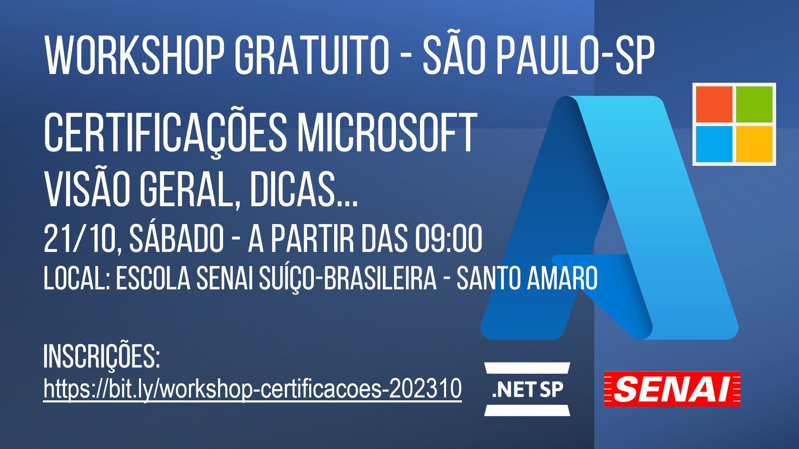
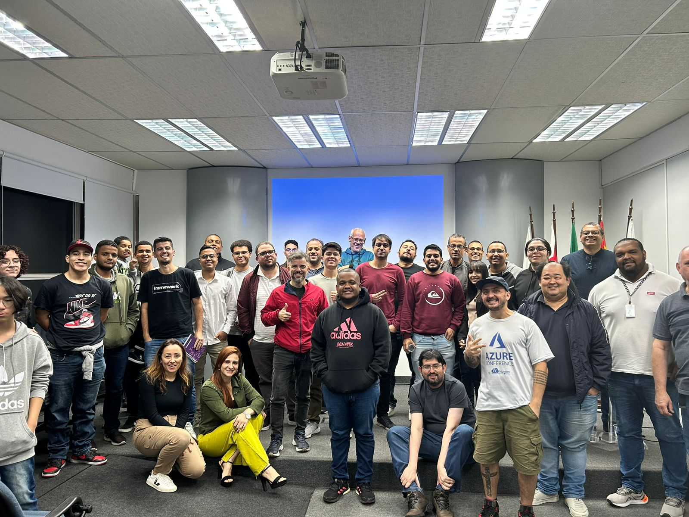
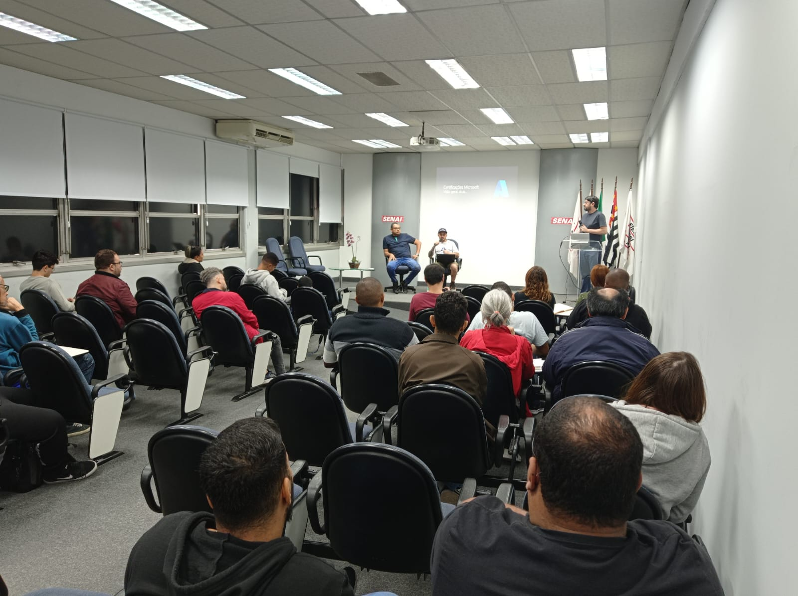
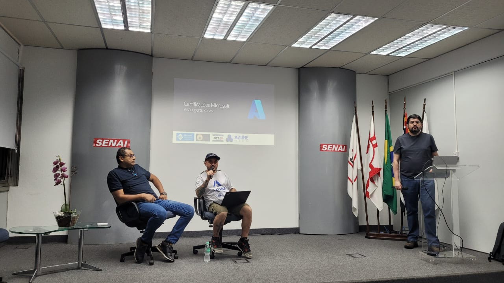
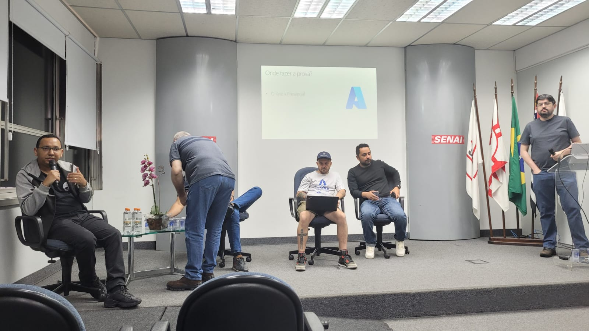

# Certificacoes-2023-10
Fotos e informações gerais sobre o evento "Workshop sobre Certificações Microsoft: visão geral, dicas...", realizado em 21/10/2023 na cidade de São Paulo-SP.

Organizadores:
- **Renato Groffe (Microsoft MVP, MTAC)**
- **Atila Olivi (SENAI)**

Número de participantes: **45 pessoas**

Especialistas que partiparam do Painel de Certificações:
- **Renato Groffe (Microsoft MVP, MTAC)**
- **Milton Camara Gomes (Microsoft MVP, MTAC)**
- **Rodrigo Jordão (Avanade)**
- **Henrique Eduardo Souza (Microsoft MVP)**
- **Johnson de Souza Cruz (MTAC)**

Foram abordadas as seguintes certificações durante o evento:
- **AZ-900: Azure Fundamentals**
- **AZ-204: Developing Solutions for Microsoft Azure**
- **AZ-400: Designing and Implementing Microsoft DevOps Solutions**
- **AI-900: Microsoft Azure AI Fundamentals**
- **AI-102: Designing and Implementing a Microsoft Azure AI **Solution**
- **DP-900: Microsoft Azure Data Fundamentals**
- **DP-420: Designing and Implementing Cloud-Native **Applications Using Microsoft Azure Cosmos DB**
- **AZ-305: Designing Microsoft Azure Infrastructure Solutions**

Acesse este [**link**](/img/) para visualizar todas as fotos das apresentações.

Este evento foi uma parceria entre a comunidade [**.NET SP**](https://www.meetup.com/dotnet-Sao-Paulo/) e a [**Escola Senai Suíço-Brasileira Paulo Ernesto Tolle**](https://suicobrasileira.sp.senai.br/).

Formulário utilizado para inscrições: [**Sympla**](https://www.sympla.com.br/evento/workshop-sobre-certificacoes-microsoft-visao-geral-dicas-gratuito-e-presencial/2191461)

Local: Escola SENAI Suíço-Brasileira Paulo Ernesto Tolle - Rua Bento Branco de Andrade Filho, 379 - Santo Amaro - São Paulo/SP - CEP 04757-000

